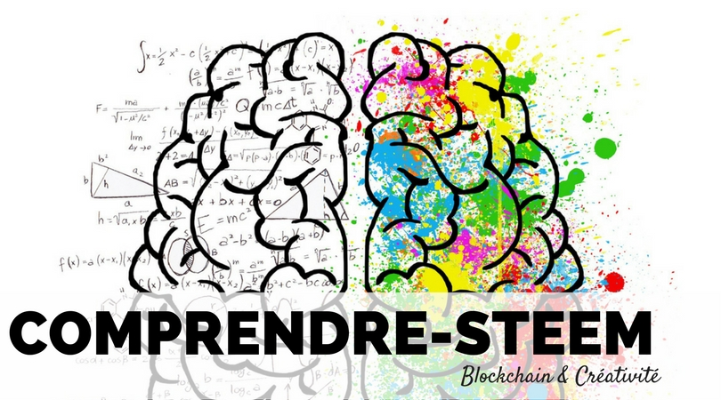

# Comprendre-steem.fr

Ce repository contient le code source du site comprendre-steem.fr.

**Comprendre-Steem.fr** est une plateforme qui à pour but d’indexer un ensemble de ressources permettant de mieux comprendre la blockchain Steem afin de l’utiliser à son plein potentiel.

La plateforme Steem présente un bel équilibre entre la technologie et la créativité. Cette plateforme vous dirigera vers des articles et des vidéos qui vous permettrons de mieux comprendre la partie technologique afin d’exprimer au mieux votre créativité.

## Utilisation des sources

**Comprendre-Steem** est un site statique créer avec l'outil [HUGO](https://gohugo.io/). Il s'agit d'un générateur de site statique écrit en Go.

### Installer Hugo

Si vous ne l'avez pas déjà, il vous faudra commencer par installer Hugo en suivant [cette procédure](https://gohugo.io/getting-started/installing).  

Vérifiez que vous avez bien la version 2.0 au minimum avec la commande suivante:

> hugo version

### Récupérer les sources

Les sources sont disponible [sur GitHub](https://github.com/oroger/comprendre-steem.git). Utilisez votre client Git préféré ou simlement la ligne de commande :

> git clone https://github.com/oroger/comprendre-steem.git

### Executer le site en local

Toujours en ligne de commande, l'instruction suivante vous permet d'executer le site en local :

> hugo server

Il sera alors disponible sur [http://localhost:1313](http://localhost:1313).

### Exporter le site

Une fois que le résultat est satisfaisant, utiliser la commande suivante:

> hugo 

Elle mettra à jour le dosser **public** avec la version finale du site.
Il suffit ensuite de copier les fichiers sur le serveur de votre choix.
Aucun module spécifique n'est requis pour ce site.

## Remerciements

Tout d’abord merci aux auteurs francophones qui participent à la rédaction et à la curation des articles en français.

Merci également à [Bootstrapious.com](https://bootstrapious.com/free-templates) pour le le template du site et à [Kishan B](https://github.com/kishaningithub) qui l’a rendu compatible avec [l’outil hugo](https://gohugo.io/).

## License

Le code source est disponible sous license MIT, voir fichier LICENSE.

